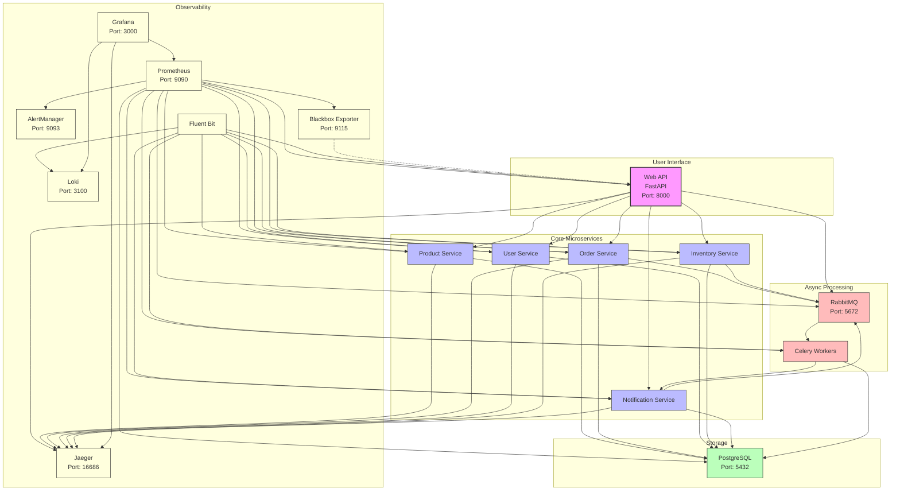
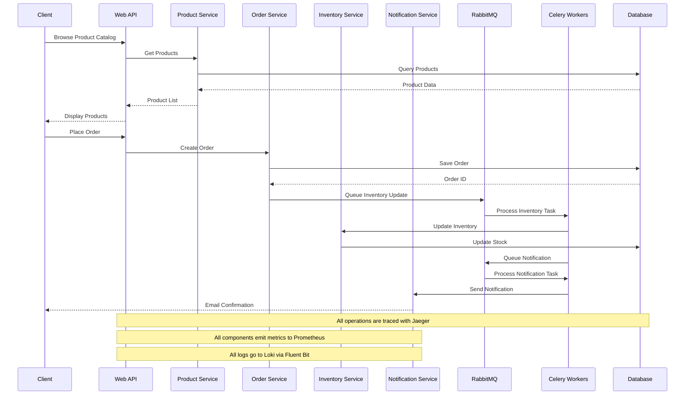

# KodeKloud Records Store

A comprehensive demo application for learning and practicing SRE, observability, and incident management concepts. This project simulates a record store e-commerce application with integrated observability tools for metrics, logs, and distributed tracing.

## Overview

The KodeKloud Records Store application demonstrates a complete observability solution built on modern best practices. It serves as a hands-on learning environment for:

- Setting up comprehensive monitoring and observability
- Implementing distributed tracing for microservices
- Designing effective alerting strategies
- Practicing incident response using real-world scenarios
- Learning SLO-based monitoring approaches

## Architecture

The application uses a microservice architecture with the following components:

- **Web API**: Python FastAPI service for the main application
- **Background Worker**: Celery worker for asynchronous tasks
- **Database**: PostgreSQL for data storage
- **Message Queue**: RabbitMQ for task distribution
- **Observability Stack**:
  - Prometheus for metrics collection
  - Grafana for visualization
  - Loki for log aggregation
  - Jaeger for distributed tracing
  - AlertManager for alert handling
  - Blackbox Exporter for synthetic monitoring
  - Fluent Bit for log collection

### Microservices Architecture Diagram



### Data Flow Diagram



## Project Structure

```
.
```

## Getting Started

### Prerequisites

- Docker and Docker Compose
- Git

### Installation and Setup

1. Clone the repository:
   ```bash
   git clone https://github.com/kodekloud/records-store-web-app.git
   cd kodekloud-records-store-web-app
   ```

2. Start the application and monitoring stack:
   ```bash
   docker-compose up -d
   ```

3. Generate test data for observability:
   ```bash
   ./scripts/generate_logs.sh
   ```

4. Access the services:
   - **Application**: http://localhost:8000
   - **API Documentation**: http://localhost:8000/docs
   - **Grafana**: http://localhost:3000 (user: admin, password: admin)
   - **Prometheus**: http://localhost:9090
   - **Jaeger UI**: http://localhost:16686
   - **Loki**: http://localhost:3100
   - **Alert Manager**: http://localhost:9093
   - **RabbitMQ Management**: http://localhost:15672 (user: guest, password: guest)

## Working with the Application

### Testing and Exploring

1. The application provides several test endpoints to generate telemetry data:
   - `/health` - Health check endpoint
   - `/trace-test` - Generate a trace with multiple spans
   - `/error-test` - Generate error logs
   - `/slow-operation` - Generate a slow operation trace

2. Generate continuous test traffic:
   ```bash
   ./test_traffic.sh
   ```

3. Run simplified black-box monitoring (sends periodic health checks):
   ```bash
   ./black_box_monitor.sh
   ```

### Key Features

1. **Metrics Collection**:
   - Application metrics (request counts, latency, errors)
   - Service health metrics
   - Business metrics (orders, products)
   - SLO-based metrics for reliability measurement

2. **Log Management**:
   - Structured logging with trace context
   - Log correlation with metrics and traces
   - Log querying with LogQL in Grafana

3. **Distributed Tracing**:
   - Request flow visualization
   - Performance bottleneck identification
   - Error propagation analysis

4. **Alerting**:
   - SLO-based alerts
   - Symptom-based alerting
   - Multiple severity levels

## Observability Exercises

The application is designed for hands-on learning with the following exercises:

1. **Understanding Metrics, Logs, and Traces**:
   - View correlated telemetry data
   - Follow a request through the system

2. **Monitoring and Alerting**:
   - Explore the pre-configured dashboards
   - Understand alerting rules and thresholds
   - Create custom alerts

3. **SLO Implementation**:
   - Learn how SLIs are defined and measured
   - Understand error budget consumption
   - Practice SLO-based alerting

4. **Incident Response**:
   - Practice troubleshooting using telemetry data
   - Analyze performance issues
   - Debug error conditions

## Troubleshooting

- **Services not starting**: Check for port conflicts with `docker-compose ps` and `netstat -tulpn`
- **No data in Grafana**: Verify Prometheus is scraping targets at http://localhost:9090/targets
- **No logs in Loki**: Check Fluent Bit is running with `docker-compose logs fluent-bit`
- **No traces in Jaeger**: Verify OpenTelemetry export with `docker-compose logs jaeger`

## Contributing

Contributions are welcome! Please feel free to submit issues and pull requests.

## License

This project is licensed under the MIT License.